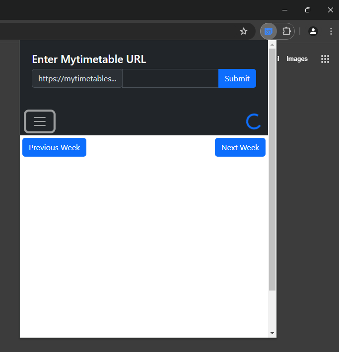

# MyTimetable Chrome Extension: Access Your University Schedule with Ease
     

### **Description:**

This Chrome extension is designed to streamline the way students access their university schedules from MyTimetable, a widely used platform affiliated with universities across the Netherlands. By providing a simple, user-friendly interface directly within the browser, students can easily view their upcoming classes and events without navigating through multiple tabs or apps.

### **Features:**

1. **Seamless Integration:** Connects directly to your MyTimetable account using the iCalendar URL provided by the platform.

2. **Real-time Updates:** Automatically syncs with your MyTimetable schedule to ensure you have the most up-to-date information at your fingertips.

3. **Offline Access:** Unlike many other similar tools, this extension allows you to access your schedule even when offline, ensuring you're never caught off guard by a sudden loss of internet connection. 

4. **Node.js Server:** Built on Node.js, ensuring a robust and scalable backend to handle data parsing and delivery efficiently.

5. **iCal to JSON Conversion:** Parses iCalendar data received from MyTimetable into JSON format, making it easier to manipulate and display on the client side.

6. **Cross-Platform Support:** Works seamlessly across different devices and operating systems, ensuring access to your schedule wherever you are.

### **How it Works:**

This extension utilizes a Node.js server to parse the iCalendar data provided by MyTimetable into JSON format. The JSON data is then sent to the client side where it is rendered in the extension's UI, allowing users to view their schedule at a glance.

**Why Use This Extension?**

- **Efficiency:** Access your university schedule directly from your browser, saving time and effort.
- **Simplicity:** No need to navigate through multiple platforms or apps; your schedule is right there in your browser.
- **Reliability:** With real-time updates, offline feature and seamless integration with MyTimetable, you can trust that your schedule is always accurate and up-to-date.

**Contributing:**

This project is open source, and contributions are welcome! Whether you want to suggest new features, report bugs, or contribute code, your input is valuable in making this extension even better for students.

**Get Started:**

1. Install the extension from the Chrome Web Store.
2. Follow the setup instructions to connect your MyTimetable account.
3. Enjoy easy access to your university schedule directly from your browser!

#  Demo Images 

 

